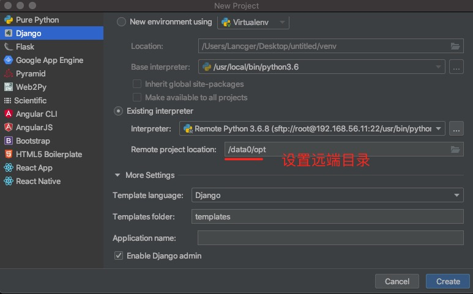

# Django之入门 CMDB系统  (一) 基础环境
---
## 前言

> 作者: 何全，github地址: https://github.com/hequan2017   QQ交流群: 620176501

> 通过此教程完成从零入门，能够独立编写一个简单的CMDB系统。

> 目前主流的方法开发方式，分为2种：mvc 和 mvvc 方式。本教程为 mvc 方式，即 django负责渲染html。后面会推出 mvvc(前后端分离)的入门教程。

> 教程项目地址: https://github.com/hequan2017/husky/

> 教程文档地址: https://github.com/hequan2017/husky/tree/master/doc


## 说明


> 框架是整个或部分系统的可重⽤设计，表现为一组抽象构件及构件实例间交互的⽅法; 另一种定
义认为，框架是可被应用开发者定制的应用骨架。

> Django是Python下的一款著名的Web框架。

* Django优点
    * 自带轮⼦众多，方便快速开发 如 Auth, Cache, 模板
    * 天生的MVC设计模式
    * 实用的管理后台
    * 自带ORM, Template, Form, Auth核⼼组件
    * 简洁的url设计
    * 周边插件丰富

## 技术准备

> 需要你有python基本代码编写能力 以及 html js 基础,  对django有一个大概了解。

## 环境介绍

* mvc 模式
* centos 7.6
* python 3.6
* django 2.2
* mysql 5.7
* pycharm 2019.2 (在Mac上 远程Centos7.6进行开发)
* vmware workstation 15.5.0
* 项目名字: husky
* cbv 编程方式

## 远端环境配置

* 安装centos 7.6系统

* 安装python3.6
```python 
yum install -y epel-release
yum install -y sqlite sqlite-devel
yum install -y python-devel mysql-devel python36-devel.x86_64
yum install -y https://centos7.iuscommunity.org/ius-release.rpm
yum install -y python36  python36-setuptools
easy_install-3.6 pip
python3.6 -m pip install --upgrade pip

mv /usr/bin/python /tmp/
ln -s /usr/bin/python3.6 /usr/bin/python

sed -i 's/\#\!\/usr\/bin\/python/\#\!\/usr\/bin\/python2/' /usr/bin/yum
sed -i 's/\#\! \/usr\/bin\/python/\#\! \/usr\/bin\/python2/' /usr/libexec/urlgrabber-ext-down

mkdir -p /root/.pip/

cat >/root/.pip/pip.conf<<EOF
[global]
trusted-host=mirrors.aliyun.com
index-url=http://mirrors.aliyun.com/pypi/simple/
EOF

python -V
```

* 安装django   

> pip3 install django==2.2.6

## 本地开发配置

* 配置pycharm

> Configure-->Preferences-->Project Interpreter--> Add --> SSH Interpreter 设置远端Python环境


> 设置/usr/bin/python3.6   目录选择 <Project root>→/opt

> File--> New Project --> Django



## 部署数据库

* 为了快速，采用docker方式部署。
```shell script
mkdir -p  /data/docker
mkdir -p /data/mysql5722

yum install -y yum-utils device-mapper-persistent-data lvm2
yum-config-manager --add-repo http://mirrors.aliyun.com/docker-ce/linux/centos/docker-ce.repo

yum makecache fast
yum install -y docker-ce

docker version
systemctl enable docker.service    
systemctl restart docker.service
systemctl status docker.service

mkdir -p /etc/docker
tee /etc/docker/daemon.json <<-'EOF'
{
    "registry-mirrors":[
        "https://890km4uy.mirror.aliyuncs.com"
    ],
    "graph":"/data/docker"
}
EOF
systemctl daemon-reload
systemctl restart docker
```

```shell script
mkdir -p /data/mysql5722
mkdir -p /data/mysql5722-cnf

docker run -itd \
--name mysql \
-p 3306:3306 \
--mount type=bind,src=/data/mysql5722,dst=/var/lib/mysql \
--mount type=bind,src=/data/mysql5722-cnf,dst=/etc/mysql \
-e MYSQL_ROOT_PASSWORD=123456 \
mysql:5.7.22 --character-set-server=utf8

yum remove -y mariadb  
yum install -y mariadb

mysql -uroot -p123456 -h 192.168.56.11
create database husky;
```

## 配置django 数据库
> husky --> settings

```shell script
ALLOWED_HOSTS = ['*']   ##允许所有地址访问


DATABASES = {
    'default': {
        'ENGINE': 'django.db.backends.mysql',
        'HOST': '192.168.56.11',
        'PORT': '3306',
        'NAME': 'husky',
        'USER': 'root',
        'PASSWORD': '123456',
    }
}

# DATABASES = {
#     'default': {
#         'ENGINE': 'django.db.backends.sqlite3',
#         'NAME': os.path.join(BASE_DIR, 'db.sqlite3'),
#     }
# }
```

* 修改python文件
```shell script
vim /usr/local/lib64/python3.6/site-packages/django/db/backends/mysql/base.py

35 #if version < (1, 3, 13):   注释掉 这两行
36 #    raise ImproperlyConfigured('mysqlclient 1.3.13 or newer is required; you have %s.' % Database.__version__)   

vim /usr/local/lib64/python3.6/site-packages/django/db/backends/mysql/operations.py

145         if query is not None:
146             query = query.encode(errors='replace')   ##修改此行
```

* 使用pymysql模块
```shell script
pip3 install -i https://pypi.mirrors.ustc.edu.cn/simple/ pymysql

#在工程目录中的__init__.py中添加如下代码
vim husky/__init__.py

import pymysql
pymysql.install_as_MySQLdb()
```

* 执行数据库初始化

> pycharm : 菜单栏 tools --> 选择Start SSH Session

> makemigrations    #生成数据文件
 
> migrate           #根据文件，执行生成表结构
 
> createsuperuser

---

> 设置pycharm项目启动地址为 192.168.56.11

> 启动服务

```shell script
linux-node1.example.com<2019-12-05 17:26:49> /data0/opt
root># python manage.py runserver 192.168.56.11:8000
Watching for file changes with StatReloader
Performing system checks...

System check identified no issues (0 silenced).
December 05, 2019 - 09:26:59
Django version 2.2.6, using settings 'husky.settings'
Starting development server at http://192.168.56.11:8000/
Quit the server with CONTROL-C.
```

## 其他

> 测试登录 http://192.168.56.11:8000/admin 输入账号密码 

> 创建 requirements.txt 文件

```shell script
pip3 freeze > requirements.txt
```

```shell script
pip3 install -r  requirements.txt    ## 安装所有模块，如有增加模块，需要加到这里面
```
